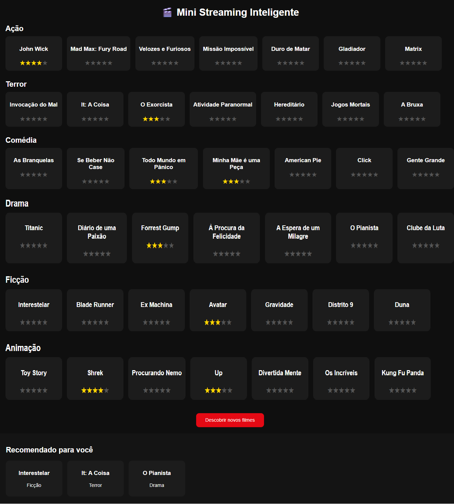

# 🎬 Mini Streaming Inteligente - Recomendador por Similaridade (kNN)

Sistema de recomendação de filmes baseado em Aprendizagem Baseada em Instâncias (Instance-Based Learning) utilizando o algoritmo k-Nearest Neighbors (kNN) para sugerir conteúdos de forma personalizada, explicável e com descoberta controlada.

Este projeto simula o funcionamento de uma plataforma de streaming real, unindo Machine Learning, matemática aplicada, arquitetura de APIs e experiência de produto (UX).

---

## 🚀 Visão Geral

O usuário navega por um catálogo organizado por gêneros em fileiras horizontais (estilo Netflix) e avalia filmes por meio de estrelas ⭐ (1 a 5).

Com base nessas avaliações, o sistema constrói automaticamente um perfil implícito ponderado de preferências e recomenda até 5 novos filmes que o usuário ainda não assistiu, mantendo:

- Alta similaridade com o gosto do usuário
- Diversidade de gêneros
- Exploração controlada (descoberta de novos conteúdos)

---

## 🗂 Base de Dados

O dataset é composto por 50 filmes famosos, distribuídos em 7 gêneros principais:

- Ação
- Terror
- Comédia
- Drama
- Ficção Científica
- Animação
- Romance

Cada filme é representado por um vetor numérico:

```text
violência, romance, ação, comédia
```

Esses vetores permitem medir matematicamente a similaridade entre gostos e conteúdos.

---

## 🧠 Motor de Recomendação (kNN)

O sistema utiliza um modelo de Aprendizagem Baseada em Instâncias, sem treinamento prévio.

### 1️⃣ Perfil Implícito Ponderado

O perfil do usuário é calculado automaticamente por média ponderada dos filmes avaliados:

```
perfil_usuario = Σ(vetor_filme × nota) / Σ(notas)
```

Filmes com notas maiores exercem maior influência no perfil do usuário.

---

### 2️⃣ Similaridade (Distância Euclidiana)

Cada filme não assistido é comparado ao perfil do usuário utilizando distância euclidiana.

Quanto menor a distância, maior a probabilidade de o filme agradar ao usuário.

---

### 3️⃣ Exploração + Diversidade

Após ordenar os filmes por similaridade:

| Camada | Função |
|-----|-----|
| Top 15 | Filmes mais próximos ao perfil |
| 3 primeiros | Alta similaridade |
| 2 aleatórios | Descoberta controlada |
| Diversidade | Evita repetição do mesmo gênero |

Resultado final: Até 5 recomendações personalizadas, variadas e relevantes.

---

## 🖥 Interface Netflix-like

A interface simula uma plataforma de streaming real:

- Catálogo organizado por gêneros em linhas com scroll horizontal
- Cards de filmes
- Avaliação por estrelas ⭐
- Área “Recomendado para você”

> 📸 Interface



---

## 🧪 Tecnologias Utilizadas

- Python
- FastAPI
- Pandas
- NumPy
- HTML + CSS
- JavaScript
- Aprendizagem Baseada em Instâncias (kNN)

---

## ▶️ Como executar

```bash
pip install -r requirements.txt
python main.py
```

Acesse:

```
http://localhost:8000/app

```

---

## 🎯 Objetivo do Projeto

Demonstrar a construção de um sistema de recomendação real, unindo:

- Matemática aplicada
- Machine Learning explicável
- Arquitetura de APIs
- Experiência de produto
- Design de sistemas

Este projeto foi desenvolvido como portfólio profissional, demonstrando competências práticas em Ciência de Dados, Machine Learning e Engenharia de Software.
